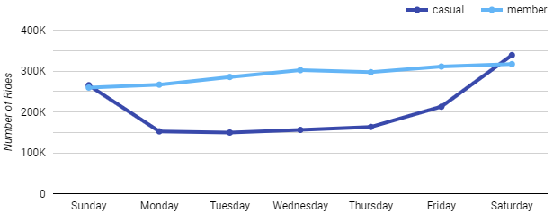
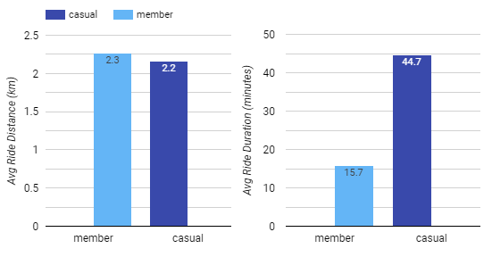
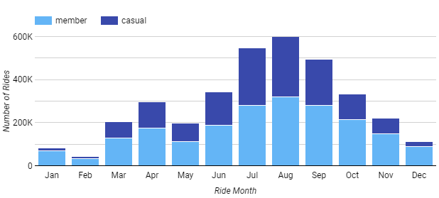

## Table of Contents

1. [Introduction](README.md#introduction)
2. [Business Task](README.md#business-task)
3. [Data](README.md#data)
4. [Processing and Cleaning](README.md#processing-and-cleaning)
5. [Analysis and Viz](README.md#analysis-and-viz)
6. [Conclusion and Recommendations](README.md#conclusions)

## Introduction

The project is a part of **Google Data Analytics Certification course capstone**. 

Case Study: Cyclistic
Case Background

As a junior data analyst working in the marketing analyst team at Cyclistic (a bike-sharing company active in Chicago), I am tasked with understanding how casual riders and annual members use Cyclistic bikes differently. Casual riders consist of customers that purchase single-ride or full-day passes, whereas annual members subscribe yearly for unlimited biking access. The marketing director theorizes that the company's future success depends on maximizing the number of yearly memberships by converting casual riders into annual members. Pending executive approval, my team will be designing a new marketing strategy that pursues this idea.

To inform any decision-making behind Cyclistic's new marketing strategy, the goal of this project will be to uncover and convey actionable insights.

If you would like to skip everything to view the results of this study, you can view my presentation here.
Scope of Work
Deliverable 	Tasks
1. Define and discuss the project 	

    Producing a scope of work document
    Framing a problem statement
    Defining project goals and the measurements to define success by discussing the project with stakeholders and ascertaining expectations

2. Extract and prepare the data for exploration 	

    Identifying where data resides and its structure
    Determining data reliability, origins, comprehensiveness, current relevance, and credibility
    Addressing licensing, privacy, security, and accessibility concerns
    Verifying data integrity
    Identifying how the data helps answer the questions we're pursuing
    Filtering and sorting the data

3. Process the data for analysis 	

    Research and apply the correct data manipulation tools for processing and analysis
    Check for dirty data - in particular for data that is outdated, duplicated, incomplete, inconsistent, and inaccurate
    Wrangle and clean the data until we can apply unbiased and representative data analytics

4. Conduct a descriptive analysis 	

    Organize and format the data (including useful aggregate tables)
    Identify trends and relationships with the help of calculations, data aggregations, and relevant visuals
    Provide a summary of the analysis

5. Share key findings with stakeholders 	

    Create an effective and accessible presentation that answers the original business problem with compelling storytelling

6. Act on key findings 	

    Based on the analysis conducted, provide three recommendations for the marketing campaign to move forward with

Deliverable: Define and discuss the project
Business Background

Business Model:

    Product: bike-sharing geotracked and network locked bikes across Chicago
    Customer types and revenue model: members (annual subscribers) and casual riders (single-ride and full-day purchasers)
    Competitive advantages: Bicycle variety (broad consumer segments) and pricing flexibility

Product Background:

    5,824 bicycles and 692 docking stations
    More than 50% of riders select traditional bikes
    8% of riders opt for the assistive bike options
    30% of users bike to commute to work each day
    Users are more likely to ride for leisure
    Casual riders have chosen Cyclistic for their mobility needs

Discussing Goals and Expectations
Stakeholders 	Expectations 	Project/Business Goals
Cyclistic Executive Team 	Compelling, relevant, and straightforward insights to inform data-driven marketing decisions 	Implementing strategic initiatives to promote business growth
Lily Moreno, Director of Marketing 	Evidence to back up her theory and marketing recommendations 	Convert a sizable group of casual riders to become annual members
Marketing analytics team 	Uncovering the differences and motivations behind different customer types 	Produce data-driven and actionable results to inform business decision making
Problem Statement

Cyclistic is faced with an uncertain future and is no longer able to solely rely on its traditional marketing strategies of raising general awareness and appealing to a variety of customer needs. In the interest of company growth, the director of marketing believes that Cyclistic should capitalize on the lucrative profit margins of annual subscribers by marketing to existing casual customers and persuading them to become yearly subscribers. If that strategy is plausible, a well-executed marketing campaign may lead to more sustainable long-term revenue. To that end, we need to analyze how and why Cyclistic casual bikers and members differ to weigh any evidence, opportunities, and barriers to any future marketing strategy.

Scenario
You are a junior data analyst working in the marketing analyst team at Cyclistic, a bike-share company in Chicago. The director of marketing believes the company’s future success depends on maximizing the number of annual memberships. Therefore, your team wants to understand how casual riders and annual members use Cyclistic bikes differently. From these insights, your team will design a new marketing strategy to convert casual riders into annual members. But first, Cyclistic executives
must approve your recommendations, so they must be backed up with compelling data insights and professional data visualizations.
Characters and teams
● Cyclistic: A bike-share program that features more than 5,800 bicycles and 600 docking stations. Cyclistic sets itself apart by also offering reclining bikes, hand tricycles, and cargo bikes, making bike-share more inclusive to people with disabilities and riders who can’t use a standard two-wheeled bike. The majority of riders opt for traditional bikes; about 8% of riders use the assistive options. Cyclistic users are more likely to ride for leisure, but about 30% use them to commute to work each day.
● Lily Moreno: The director of marketing and your manager. Moreno is responsible for the development of campaigns and initiatives to promote the bike-share program. These may include email, social media, and other channels.
● Cyclistic marketing analytics team: A team of data analysts who are responsible for collecting, analyzing, and reporting data that helps guide Cyclistic marketing strategy. You joined this team six months ago and have been busy learning about Cyclistic’s mission and business goals — as well as how you, as a junior data analyst, can help Cyclistic achieve them.
● Cyclistic executive team: The notoriously detail-oriented executive team will decide whether to approve the recommended marketing program. The scenario involves analysis of the trip data of Cyclistic bike share company.

The company has two models for availing service: individual passes which are called "casual" riders and annual subscriptions called "member" riders.
The company operates in Chicago with around 6000 bicycles at 700 stations.

Maximizing the number of annual members will be key to future growth as it ensures financial sustainability and customer retention. The insights can help devise effective marketing strategies aimed to convert more casual riders into annual members.

## Business Task

How do annual members and casual riders use Cyclistic bikes differently ?

> **Objective** : To clean, analyze and visualize the data to observe how casual riders use the bike rentals differently from annual member riders. 

## Data

* **Data source** : Public data from Motivate International Inc. (Divvy Bicycle Sharing Service from Chicago) under this [license](https://www.divvybikes.com/data-license-agreement).
* [Cyclistic’s historical trip data](https://divvy-tripdata.s3.amazonaws.com/index.html) (2013 onwards) available in `.csv` format. 
* **Our date range** : May 2020 to April 2021 (608 MB data)
* The dataset has individual ride records consisting of ride start-end date & time, station information, bike type, rider type (casual/member).
* Data uploaded to Google Cloud Storage(GCS) in order to import the large files.

## Processing and Cleaning

* Data imported from GCS into **BigQuery** for manipulation and analysis using SQL.
* Visualizations to be developed in **Google Data Studio**.
* Datatypes made consistent and then consolidated into one view using [this query](https://github.com/shivamgarg444/Cyclistic-Case-Study/blob/main/uncleaned_compile.sql).
* To assist in analysis, 4 new columns were added (start point location, end point location, ride start day name and ride duration in seconds).
* `3,742,624` rows were returned but required cleaning.
* **Cleaning process** :
  * Missing start and end station names found using [this query](station_check.sql).
  * Other columns checked using [this query](columns_check.sql).
  * Negative and zero ride duration values found using [this query](duration_check.sql).
> Following the cleaning and consolidating data in one table, `3,476,354` rows were returned for proceeding to analysis. All of this was achieved using [this single master query](single_query.sql). `JOIN`, `WITH`, `UNION ALL`, `WHERE`, _subqueries_ and many other SQL functions were used here.

## Analysis and Viz

The final dataset containing trip data of roughly 3.4 million ride records was analyzed. 
Visualizations were developed in Google Data Studio to observe differential trends between the usage by casual riders and annual members.  

### Total ride share

#### **Insights**
* 58.6% of total rides (3.4M) were taken by annual members.
* 41.4% of total rides were taken by casual riders.
* Annual members form the majority of business for the company and maximizing on this number should be the focus in the long run.

### Weekly distribution of number of rides

#### **Insights**
* Clearly, the rides taken by casual riders __peak__ throughout the __weekend__ as compared to that of annual members which remains relatively flat. 
* About __50% less__ casual riders use the rentals during weekdays as compared to weekends.  
* This indicates that casual riders use the bike rentals for leisure purposes and not for commuting.     

### Weekly distribution of average ride duration

#### **Insights**
* The average ride duration of casual members is  about __3 times__ that of annual members.
* The average ride duration both type of riders increase on weekends.
* Again, this indicates that casual riders use the bike rentals for leisure purposes.  

### Ride duration vs Ride distance

#### **Insights**
* The plots clearly show the contrast between average ride duration and average ride distance  for both user types. 
* While both user types ride a __similar average distance__, casual riders ride for __3x longer duration__ as compared to annual members.     

### Hourly distribution of number of rides

#### **Insights**
* The proportion of casual riders increases in the non-commuting hours i.e. in forenoon hours and after 8pm from __18%__ of total riders to __50%__ of total riders.
* Annual members take the major chunk of the rides during peak-travel hours in the morning and evening to upto __82%__ of total riders. 
* Again, this indicates that casual riders use the bike rentals for leisure purposes while annual members use it for commuting.  

### Monthly distribution of number of rides - Seasonality 

#### **Insights**
* The proportion of casual riders __falls__ drastically during winter months(Dec-Feb) to only about __20%__ of total riders.
* The proportion of casual riders goes __maximum__ in the months of June, July, August and September to upto __40%__ of total riders.  

## Conclusion and Recommendations

* A common observation is that __casual riders__ are using the bike rentals for __leisure and tourism__ purposes while __annual members__ use it predominantly for __commuting__ purposes.
* Targetted on-ground marketing strategies should be devised at places of leisure like parks, theatres, restaurants and cafes.  
* Discounting campaigns for casual riders on weekdays can motivate them to use the service for commuting. 
* Tools like push notifications can be used to attract casual riders during the lean periods of the day.
* A campaign for the winter months, maybe clubbed with holidays or Christmas can help pick up the numbers during those months. 
