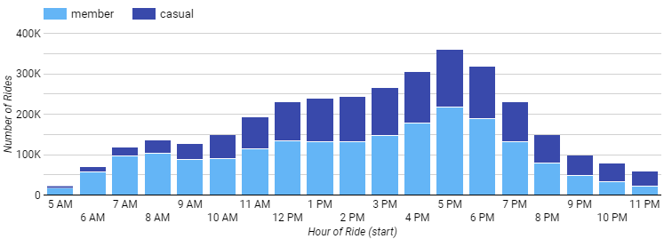

## Table of Contents

1. [Introduction](README.md#introduction)
2. [Business Task](README.md#business-task)
3. [Data](README.md#data)
4. [Processing and Cleaning](README.md#processing-and-cleaning)
5. [Analysis and Viz](README.md#analysis-and-viz)
6. [Conclusion and Recommendations](README.md#conclusions)

## Introduction

The project is a part of **Google Data Analytics Capstone Project-Case Study: How Does a Bike-Share Navigate Speedy Success?**. 

**Scenario**

You are a junior data analyst working in the marketing analyst team at Cyclistic, a bike-share company in Chicago. The director
of marketing believes the company’s future success depends on maximizing the number of annual memberships. Therefore,
your team wants to understand how casual riders and annual members use Cyclistic bikes differently. From these insights,
your team will design a new marketing strategy to convert casual riders into annual members.

**Characters and teams**

● **Cyclistic:** A bike-share program that features more than 5,800 bicycles and 600 docking stations. Cyclistic sets itself
apart by also offering reclining bikes, hand tricycles, and cargo bikes, making bike-share more inclusive to people with
disabilities and riders who can’t use a standard two-wheeled bike. The majority of riders opt for traditional bikes; about
8% of riders use the assistive options. Cyclistic users are more likely to ride for leisure, but about 30% use them to
commute to work each day.

● **Lily Moreno:** The director of marketing and your manager. Moreno is responsible for the development of campaigns
and initiatives to promote the bike-share program. These may include email, social media, and other channels.

● **Cyclistic marketing analytics team:** A team of data analysts who are responsible for collecting, analyzing, and
reporting data that helps guide Cyclistic marketing strategy. You joined this team six months ago and have been busy
learning about Cyclistic’s mission and business goals — as well as how you, as a junior data analyst, can help Cyclistic
achieve them.

● **Cyclistic executive team:** The notoriously detail-oriented executive team will decide whether to approve the
recommended marketing program.

**About the company**

In 2016, Cyclistic launched a successful bike-share offering. Since then, the program has grown to a fleet of 5,824 bicycles that are geo-tracked and locked into a network of 692 stations across Chicago. The bikes can be unlocked from one station and returned to any other station in the system anytime.

Until now, Cyclistic’s marketing strategy relied on building general awareness and appealing to broad consumer segments. One approach that helped make these things possible was the flexibility of its pricing plans: single-ride passes, full-day passes, and annual memberships. Customers who purchase single-ride or full-day passes are referred to as casual riders. Customers who purchase annual memberships are Cyclistic members.

Cyclistic’s finance analysts have concluded that annual members are much more profitable than casual riders. Although the pricing flexibility helps Cyclistic attract more customers, Lily Moreno (Cyclistic’s director of marketing) believes that maximizing the number of annual members will be key to future growth. Rather than creating a marketing campaign that targets all-new customers, Moreno believes there is a very good chance to convert casual riders into members. She notes that casual riders are already aware of the Cyclistic program and have chosen Cyclistic for their mobility needs. Moreno has set a clear goal: Design marketing strategies aimed at converting casual riders into annual members. In order to do that, however, the marketing analyst team needs to better understand how annual members and casual riders differ, why casual riders would buy a membership, and how digital media could affect their marketing tactics. Moreno and her team are interested in analyzing the Cyclistic historical bike trip data to identify trends.

The company has two models for availing service: individual passes which are called "casual" riders and annual subscriptions called "member" riders.
The company operates in Chicago with around 6000 bicycles at 700 stations.

Maximizing the number of annual members will be key to future growth as it ensures financial sustainability and customer retention. The insights can help devise effective marketing strategies aimed to convert more casual riders into annual members.

## Business Task

How do annual members and casual riders use Cyclistic bikes differently ?

Why would casual riders buy Cyclistic annual memberships?

How can Cyclistic use digital media to influence casual riders to become members?

> **Objective** : To clean, analyze and visualize the data to observe how casual riders use the bike rentals differently from annual member riders. 

## Data

* **Data source** : Public data from Motivate International Inc. (Divvy Bicycle Sharing Service from Chicago) under this [license](https://www.divvybikes.com/data-license-agreement).
* [Cyclistic’s historical trip data](https://divvy-tripdata.s3.amazonaws.com/index.html) (2013 onwards) available in `.csv` format. 
* **Our date range** : May 2020 to April 2021 (608 MB data)
* The dataset has individual ride records consisting of ride start-end date & time, station information, bike type, rider type (casual/member).
* Data uploaded to Google Cloud Storage(GCS) in order to import the large files.

## Processing and Cleaning

* Data imported from GCS into **BigQuery** for manipulation and analysis using SQL.
* Visualizations to be developed in **Google Data Studio**.
* Datatypes made consistent and then consolidated into one view using [this query](https://github.com/mohit-luthra/Google-Data-Analytics-Capstone-Case-Study/blob/main/uncleaned_compile.sql).
* To assist in analysis, 4 new columns were added (start point location, end point location, ride start day name and ride duration in seconds).
* `3,742,624` rows were returned but required cleaning.
* **Cleaning process** :
  * Missing start and end station names found using [this query](station_check.sql).
  * Other columns checked using [this query](columns_check.sql).
  * Negative and zero ride duration values found using [this query](duration_check.sql).
> Following the cleaning and consolidating data in one table, `3,476,354` rows were returned for proceeding to analysis. All of this was achieved using [this single master query](single_query.sql). `JOIN`, `WITH`, `UNION ALL`, `WHERE`, _subqueries_ and many other SQL functions were used here.

## Analysis and Visualisation

The final dataset containing trip data of roughly 3.4 million ride records was analyzed. 
Visualizations were developed in Google Data Studio to observe differential trends between the usage by casual riders and annual members.  

### Total ride share

#### **Insights**
* 58.6% of total rides (3.4M) were taken by annual members.
* 41.4% of total rides were taken by casual riders.
* Annual members form the majority of business for the company and maximizing on this number should be the focus in the long run.

### Weekly distribution of number of rides

#### **Insights**
* Clearly, the rides taken by casual riders __peak__ throughout the __weekend__ as compared to that of annual members which remains relatively flat. 
* About __50% less__ casual riders use the rentals during weekdays as compared to weekends.  
* This indicates that casual riders use the bike rentals for leisure purposes and not for commuting.     

### Weekly distribution of average ride duration

#### **Insights**
* The average ride duration of casual members is  about __3 times__ that of annual members.  There seems to be a difference between ride length for casual and annual members. Here, it seems that the average ride length for casual members is about 38 minutes, compared to just under 15 minutes for annual members
* The average ride duration both type of riders increase on weekends.
* Again, this indicates that casual riders use the bike rentals for leisure purposes.  

### Ride duration vs Ride distance

#### **Insights**
* The plots clearly show the contrast between average ride duration and average ride distance  for both user types. 
* While both user types ride a __similar average distance__, casual riders ride for __3x longer duration__ as compared to annual members.     

### Hourly distribution of number of rides

#### **Insights**
**Thus, we were able to see that not only do casual and annual members have different average ride times, but we see that their activity ranges, with annual members taking more rides during the weekdays and casual riders taking more and longer rides during the weekends!
**
* The proportion of casual riders increases in the non-commuting hours i.e. in forenoon hours and after 8pm from __18%__ of total riders to __50%__ of total riders.
* Annual members take the major chunk of the rides during peak-travel hours in the morning and evening to upto __82%__ of total riders. 
* Again, this indicates that casual riders use the bike rentals for leisure purposes while annual members use it for commuting.  

### Monthly distribution of number of rides - Seasonality 

#### **Insights**
* The proportion of casual riders __falls__ drastically during winter months(Dec-Feb) to only about __20%__ of total riders.
* The proportion of casual riders goes __maximum__ in the months of June, July, August and September to upto __40%__ of total riders.  

## Conclusion and Recommendations

* A common observation is that __casual riders__ are using the bike rentals for __leisure and tourism__ purposes while __annual members__ use it predominantly for __commuting__ purposes.
* To encourage casual riders to become members, a digital campaign which encourages Chicago locals to observe how Cyclistic fits into their every day life would be beneficial. Targetted on-ground marketing strategies should be devised at places of leisure like parks, theatres, restaurants and cafes.  
* Discounting campaigns for casual riders on weekdays can motivate them to use the service for commuting. 
* Tools like push notifications can be used to attract casual riders during the lean periods of the day.
* A campaign for the winter months, maybe clubbed with holidays or Christmas can help pick up the numbers during those months. 
* Email reminders for casual riders to observe the price benefit of annual memberships.
* Digital campaign showing the benefits of using a Cyclistic bike in a post-COVID-19 society.

